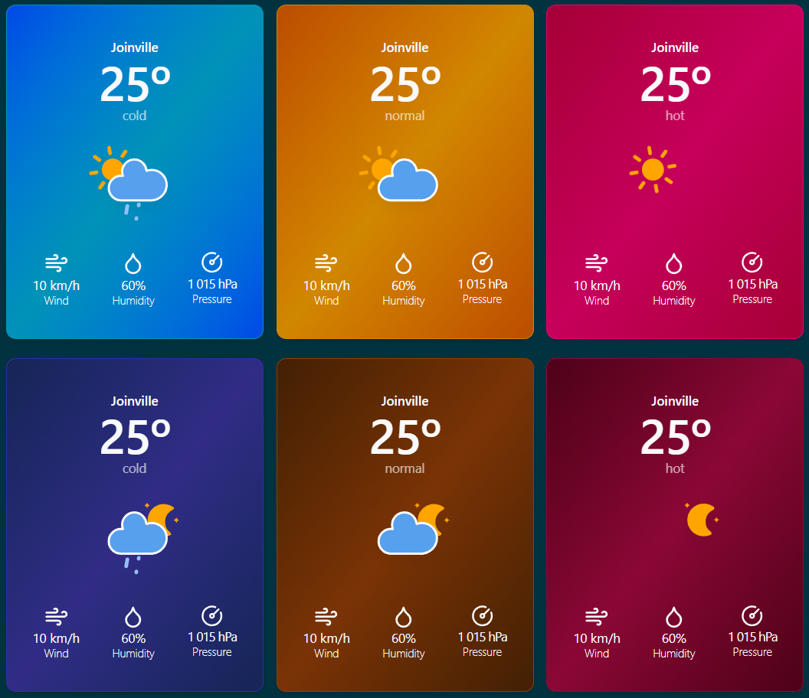

# Weather app

The Weather App gets API climate data and shows the most updated information at its location.<br/>
It was made using React, Tanstack Query, Tanstack Router, Tailwind, and ShadcnUI.

https://github.com/user-attachments/assets/479edf65-64e0-404e-803b-07e224805e50


## WeatherCard Component
The main application component includes a light mode for daytime use and a 
dark mode for nighttime use.

Additionally, this component features three background colors based on temperature:
- Blue: for temperatures of 5ºC or lower
- Orange: for temperatures greater than 5ºC and up to 25ºC
- Red: for temperatures above 25ºC




# Getting Started

To run this application:

```bash
bun install
bun run start
```

# Building For Production

To build this application for production:

```bash
bun run build
```

## Testing

This project uses [Vitest](https://vitest.dev/) for testing. You can run the tests with:

```bash
bun run test
```

## Styling

This project uses [Tailwind CSS](https://tailwindcss.com/) for styling.

## Linting & Formatting

This project uses [eslint](https://eslint.org/) and [prettier](https://prettier.io/) for linting and formatting. Eslint is configured using [tanstack/eslint-config](https://tanstack.com/config/latest/docs/eslint). The following scripts are available:

```bash
bun run lint
bun run format
bun run check
```

## Routing

This project uses [TanStack Router](https://tanstack.com/router). The initial setup is a file based router.
Which means that the routes are managed as files in `src/modules`.

### Adding A Route

To add a new route to your application just add another a new file in the 
`./src/modules` directory.

TanStack will automatically generate the content of the route file for you.


### Adding Links

To use SPA (Single Page Application) navigation import the `Link` component 
from `@tanstack/react-router`.

```tsx
import { Link } from '@tanstack/react-router'
```

Then anywhere in your JSX you can use it like so:

```tsx
<Link to="/about">About</Link>
```

This will create a link that will navigate to the `/about` route.
More information on the `Link` component can be found in the [Link documentation](https://tanstack.com/router/v1/docs/framework/react/api/router/linkComponent).

### Using A Layout

In the File Based Routing setup the layout is located in `src/modules/__root.tsx`. 
Anything you add to the root route will appear in all the routes. 
The route content will appear in the JSX where you use the `<Outlet />` component.

Here is an example layout that includes a header:

```tsx
import { Outlet, createRootRoute } from '@tanstack/react-router'
import { TanStackRouterDevtools } from '@tanstack/react-router-devtools'

import { Link } from '@tanstack/react-router'

export const Route = createRootRouteWithContext<{ queryClient: QueryClient }>()({
  component: RootComponent,
})

function RootComponent() {
  return (
    <main className="f-col w-full items-center">

      <div className="f-col mb-32 w-full max-w-7xl">
        <TopMenu />
        <Outlet />
      </div>

      <ReactQueryDevtools />
      <TanStackRouterDevtools />
    </main>
  )
}
```

Use the `<TanStackRouterDevtools />` and `<ReactQueryDevtools />` to debug the application.
<br/>
More information on layouts can be found in the [Layouts documentation](https://tanstack.com/router/latest/docs/framework/react/guide/routing-concepts#layouts).

### React-Query

React-Query is an excellent addition or alternative to route loading.
You can use `useQuery` to fetch your data.

```tsx
import { useQuery } from '@tanstack/react-query'

import './App.css'

function App() {
  const { data } = useQuery({
    queryKey: ['people'],
    queryFn: () =>
      fetch('https://swapi.dev/api/people')
        .then((res) => res.json())
        .then((data) => data.results as { name: string }[]),
    initialData: [],
  })

  return (
    <div>
      <ul>
        {data.map((person) => (
          <li key={person.name}>{person.name}</li>
        ))}
      </ul>
    </div>
  )
}

export default App
```

You can find out everything you need to know on how to use React-Query in the [React-Query documentation](https://tanstack.com/query/latest/docs/framework/react/overview).


# Learn More

You can learn more about all of the offerings from TanStack in the [TanStack documentation](https://tanstack.com).
